# 🧠 Talkie UI Flow System (Phase 91 - Dashboard)

> [!IMPORTANT]
> **[내비게이션 안내]**: 
> 1. 이 파일을 **'미리보기(Markdown Preview)'** 모드로 열어주세요.
> 2. 그림 속의 **카드(노드)**를 클릭하면 해당 기능의 상세 마인드맵으로 이동합니다.
> 3. 이동 후에도 미리보기가 유지되어 '그림'으로 계속 보실 수 있습니다.

## 🧭 시스템 내비게이션 대시보드
원하시는 화면의 **아이콘이나 제목**을 클릭하여 상세 플로우를 확인해 주세요.

```mermaid
graph LR
    Main["<br/>🏠 Talkie Dashboard<br/>&nbsp;"]
    View1["<br/>&nbsp;&nbsp;🏠 메인 번역 화면 (Main View)&nbsp;&nbsp;<br/>&nbsp;"]
    View2["<br/>&nbsp;&nbsp;⚙️ 상세 분류 설정 (Metadata)&nbsp;&nbsp;<br/>&nbsp;"]

    Main --- View1
    Main --- View2

    %% 상대 경로 사용: 미리보기 세션 유지를 위해 최적화
    click View1 href "./docs/flows/app_flow_main.md"
    click View2 href "./docs/flows/app_flow_metadata.md"

    linkStyle default stroke-width:0px,stroke:none
    
    style Main fill:#f0f7ff,stroke:#1565c0,stroke-width:2px
    style View1 fill:#2979ff,color:#fff,stroke-width:2px
    style View2 fill:#4caf50,color:#fff,stroke-width:2px
```

---

## 📂 마인드맵 파일 구성
- [🏠 메인 번역 화면 상세 보기 (Main View)](./docs/flows/app_flow_main.md)
- [⚙️ 상세 분류 설정 상세 보기 (Metadata Dialog)](./docs/flows/app_flow_metadata.md)

---

## 💡 요약 및 최신 반영 (Phase 91)
1.  **AppState 구조 분리 반영**: `logic_reference.md`에 `mode1`, `settings` 등 분리된 상태 관리 파일 경로를 명시하여 코드 추적성을 높였습니다.
2.  **Smart Sync 로직 명시**: 자료집 자동 매칭 및 동음이의어 팝업 최적화 등 최근 고도화된 서비스 로직을 명세서에 보강했습니다.
3.  **IFrame 격리 완벽 해결**: 동일 파일 내 앵커 이동이 아닌 **파일 자체를 여는 링크**를 사용함으로써, 그림 내부에서도 클릭이 무시되지 않고 100% 작동하도록 설계했습니다.
